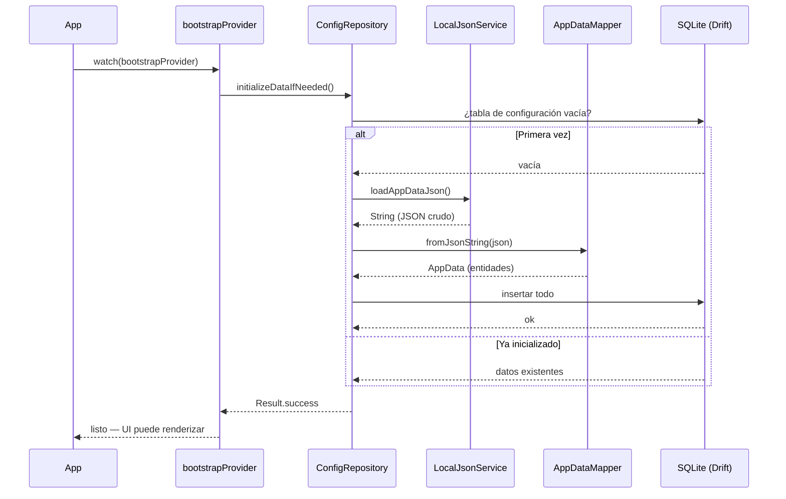
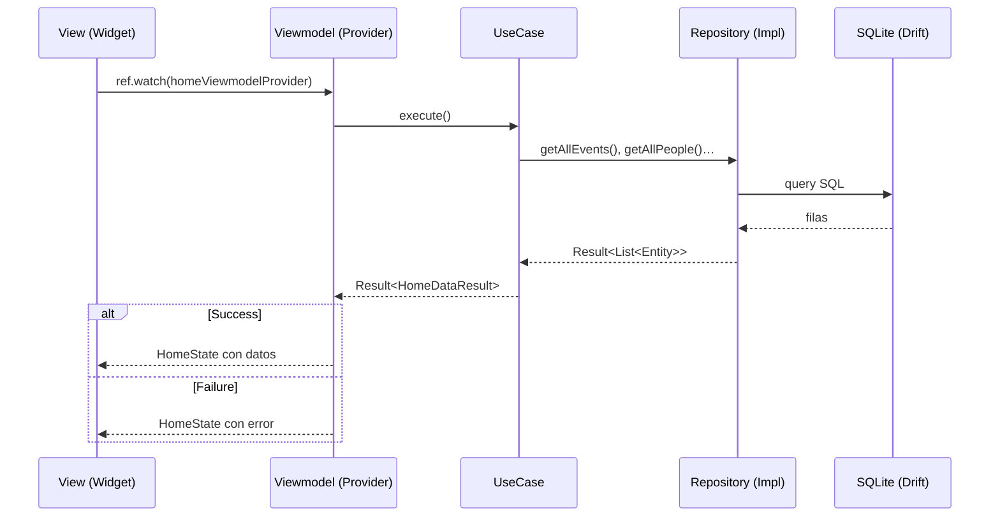
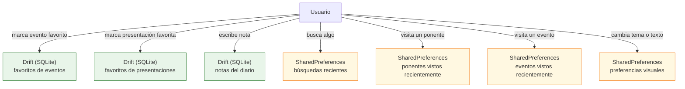

# Flujo de datos

Este documento describe cómo circulan los datos en la aplicación: **desde el JSON inicial hasta la pantalla**, y qué ocurre con los datos que genera el usuario.

## 1. Arranque del JSON a la base de datos



La primera vez que la app se lanza, los datos del congreso se cargan desde el JSON empaquetado en los assets y se persisten en SQLite. En los arranques siguientes, la carga del JSON se omite.

## 2. Lectura de la base de datos a la pantalla



Una vez inicializada la BD, cada pantalla solicita sus datos a través de un caso de uso. El resultado siempre se envuelve en `Result<T>`.

> El **contrato** (`Repository` interface) es una restricción de tipos en compilación.
>
> En tiempo de ejecución, Riverpod inyecta directamente la implementación (`RepositoryImpl`) — no existe delegación entre los dos.

## 3. El patrón `Result<T>`

Todos los repositorios y casos de uso devuelven `Result<T>` en lugar de lanzar excepciones. Esto hace los errores explícitos y obliga a tratarlos en el punto de uso.

```dart
// Definición (lib/core/errors/result.dart)
sealed class Result<T> { const Result(); }

class Success<T> extends Result<T> {
  const Success(this.data);
  final T data;
}

class Failure<T> extends Result<T> {
  const Failure(this.message);
  final String message;
}
```

**Uso en un viewmodel:**

Aqui se consume el resultado de un caso de uso en un viewmodel. El patrón `switch` obliga a manejar ambos casos (éxito y error) de forma explícita.

```dart
final result = await _useCase.execute();

return switch (result) {
  Success(data: final d) => HomeState.loaded(d),
  Failure(message: final m) => HomeState.error(m),
};
```

## 4. Datos del usuario: qué se guarda y dónde

Los datos que genera el usuario (favoritos, notas, preferencias) se persisten en **dos almacenes distintos** según su naturaleza.



| Almacén               | Cuándo usarlo                                                                   |
| --------------------- | ------------------------------------------------------------------------------- |
| **Drift (SQLite)**    | Datos estructurados, con relaciones o que requieren consultas: notas, favoritos |
| **SharedPreferences** | Valores simples, listas de IDs, preferencias de UI                              |

## 5. Streams reactivos

Algunos repositorios exponen `Stream<T>` en lugar de `Future<Result<T>>`. Esto permite que la UI se actualice automáticamente cuando cambia un dato, sin necesidad de refrescar manualmente.

Los casos de uso que observan datos en tiempo real siguen el prefijo `Watch`:

| Caso de uso                         | Stream que expone                                       |
| ----------------------------------- | ------------------------------------------------------- |
| `WatchDiaryNotesUseCase`            | `Stream<List<DiaryNote>>`                               |
| `WatchFavoritesUseCase`             | `Stream<Set<String>>` (IDs de eventos favoritos)        |
| `WatchPresentationFavoritesUseCase` | `Stream<Set<String>>` (IDs de presentaciones favoritas) |

Riverpod convierte estos streams en providers que la UI observa directamente con `ref.watch`.
