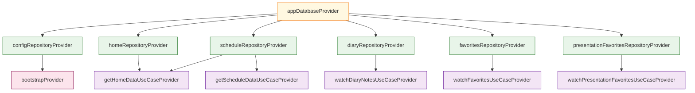
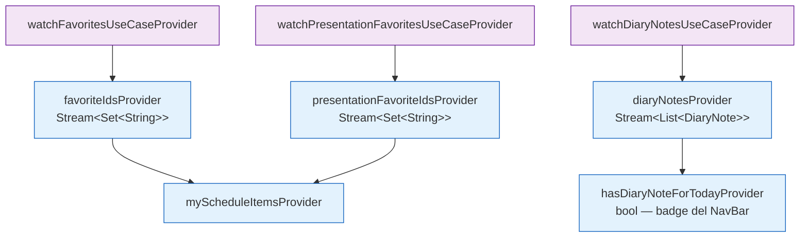

# Inyección de dependencias

La app usa **Riverpod**, como sistema de inyección de dependencias y gestión de estado.

En lugar de crear objetos manualmente o usar *singletons globales*, cada pieza del sistema se declara como un provider y Riverpod se encarga de instanciarla, cachearla y destruirla en el momento adecuado.

## 1. Cómo funciona un provider

Los providers se declaran con la anotación `@riverpod`.

El generador de código (`riverpod_generator`) produce automáticamente el provider tipado en el fichero `.g.dart` correspondiente.

```dart
// Declaración (lib/di/data_providers.dart)
@riverpod
ScheduleRepository scheduleRepository(Ref ref) {
  final db = ref.watch(appDatabaseProvider); // depende de otro provider
  return ScheduleRepositoryImpl(db);
}

// Uso en un widget o viewmodel
final repo = ref.watch(scheduleRepositoryProvider);
```

> Los ficheros `.g.dart` son generados por `build_runner`. No se deben editar a mano.

## 2. Árbol de dependencias

El árbol se divide en dos niveles para facilitar su lectura.

**Nivel 1 — de la base de datos a los repositorios y casos de uso:**



**Nivel 2 — providers derivados y streams que consume la UI:**



## 3. Ficheros en `lib/di/`

| Fichero                 | Qué provee                               | Depende de       |
| ----------------------- | ---------------------------------------- | ---------------- |
| `core_providers.dart`   | `AppDatabase`                            | —                |
| `data_providers.dart`   | Todos los repositorios                   | `core_providers` |
| `domain_providers.dart` | Casos de uso, streams derivados, índices | `data_providers` |
| `bootstrap.dart`        | Inicialización al arrancar               | `data_providers` |

## 4. Ciclo de vida de un provider

Riverpod gestiona automáticamente cuándo crear y destruir cada provider:

- **Se crea** la primera vez que algo hace `ref.watch` o `ref.read` sobre él.
- **Se mantiene** mientras haya al menos un observador activo.
- **Se destruye** cuando ya no hay nadie observándolo (por defecto) o cuando el widget que lo observa sale del árbol.

El caso especial es `AppDatabase`: se registra `ref.onDispose(db.close)` para garantizar que la conexión SQLite se cierra correctamente.

```dart
@riverpod
AppDatabase appDatabase(Ref ref) {
  final db = AppDatabase();
  ref.onDispose(db.close); // Drift requiere cerrar la BD al destruir el provider
  return db;
}
```

## 5. Providers con parámetros

Algunos providers reciben argumentos para filtrar datos. Riverpod los trata como providers independientes cacheados por parámetro:

```dart
// Devuelve las presentaciones agrupadas por los IDs de bloque solicitados
@riverpod
Future<Map<String, List<Presentation>>> presentationsForSlot(
  Ref ref,
  List<String> blockIds, // parámetro
) async { ... }

// Uso
ref.watch(presentationsForSlotProvider(['block-1', 'block-2']));
```

## 6. `ref.watch` vs `ref.read`

Es la fuente más frecuente de bugs con Riverpod. La regla es simple:

| Método      | Cuándo usarlo                                                    | Ejemplo                                                 |
| ----------- | ---------------------------------------------------------------- | ------------------------------------------------------- |
| `ref.watch` | Dentro de `build()` o en el cuerpo de un provider — **reactivo** | `final repo = ref.watch(scheduleRepositoryProvider)`    |
| `ref.read`  | Dentro de callbacks y acciones — **puntual, no reactivo**        | `ref.read(navigationProvider.notifier).select(feature)` |

> Usar `ref.watch` dentro de un callback provoca lecturas en momentos incorrectos del ciclo de vida. Usar `ref.read` en `build()` hace que el widget no se actualice cuando el valor cambia.

## 7. Providers derivados

Algunos providers no consultan la BD directamente, sino que transforman el resultado de otro provider.

Esto evita reconstrucciones innecesarias en la UI:

```dart
// Solo reconstruye el NavBar cuando el bool cambia,
// no en cada actualización de la lista de notas.
@riverpod
bool hasDiaryNoteForToday(Ref ref) {
  final today = DateTime.now();
  final notes = ref.watch(diaryNotesProvider).value ?? [];
  return notes.any((n) =>
    n.date.year == today.year &&
    n.date.month == today.month &&
    n.date.day == today.day,
  );
}
```
