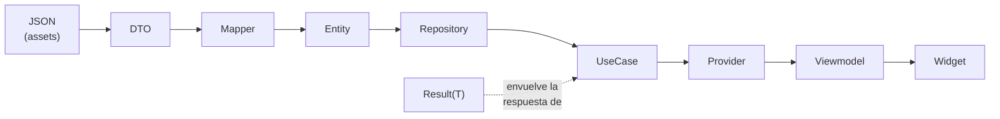

<!-- markdownlint-disable MD051 -->

# Glosario

Referencia centralizada de los términos técnicos del proyecto.

Cada término aparece definido una sola vez; el resto de documentos lo referencian aquí en lugar de redefinirlo.

## 1. Flujo de términos

El siguiente diagrama muestra cómo se relacionan los términos principales a lo largo del flujo de datos, desde los assets hasta la pantalla.



> `I18nStr` es un campo dentro de `Entity`. `Domain logic` opera sobre `Entity` sin pasar por `Repository`.

## 2. Términos por capa

### 2.1. Capa `core/`

#### 2.1.1. Result\<T\>

Tipo unión que representa éxito (`Success<T>`) o error (`Failure`). Los casos de uso siempre devuelven `Future<Result<T>>`. Evita el uso de excepciones como flujo de control.

```dart
// domain/usecases/get_home_data_usecase.dart
Future<Result<HomeData>> execute() async {
  return repository.getHomeData();
}
```

> Definido en `core/errors/result.dart`.

#### 2.1.2. Design token

Constante de diseño con nombre semántico. En lugar de escribir `16.0` directamente, se usa `AppSpacing.m`. Si el valor cambia, el cambio ocurre en un único sitio.

| Clase         | Qué agrupa                             |
| ------------- | -------------------------------------- |
| `AppSpacing`  | márgenes y separaciones                |
| `AppRadius`   | radios de esquinas                     |
| `AppDuration` | duraciones de animaciones              |
| `AppOpacity`  | valores de opacidad                    |
| `AppTextSize` | tamaños de texto fuera del `textTheme` |

Todos en `core/constants/`.

#### 2.1.3. AppStrings

Clase con todas las cadenas de texto de la interfaz. Centraliza los literales para evitar strings dispersos en los widgets. Si la app añade soporte i18n real en el futuro, `AppStrings` es el único fichero que cambia.

> Ubicada en `core/constants/app_strings.dart`.

### 2.2. Capa `domain/`

#### 2.2.1. Entity

Objeto de negocio puro: solo campos y lógica derivada (sin base de datos, sin HTTP). Es el vocabulario del dominio. Inmutable.

```dart
// domain/entities/event.dart
class Event {
  final String id;
  final I18nStr title;
  final DateTime startTime;
  // ...
}
```

> Vive en `domain/entities/`.

#### 2.2.2. I18nStr

Tipo de dato para campos multilingües. Envuelve un `Map<String, String>` donde la clave es el código de idioma (`'en'`, `'es'`…).

```dart
class I18nStr {
  final Map<String, String> values;

  String resolve(String locale) {
    return values[locale] ?? values['en'] ?? values.values.first;
  }
}
```

El método `resolve(locale)` devuelve el texto del idioma solicitado con fallback a inglés. La responsabilidad de cuándo resolver es de `presentation`, no de `domain`.

#### 2.2.3. Repository (contrato)

Interfaz en `domain/repositories/` que define qué operaciones de datos existen, sin especificar cómo se implementan. El dominio depende del contrato, no de la implementación.

```dart
abstract interface class HomeRepository {
  Future<Result<HomeData>> getHomeData();
}
```

> El contrato base genérico es `BaseRepository<T>`, que expone `getAll()` y `getById()`.

#### 2.2.4. UseCase

Clase con un único método público que orquesta repositorios y devuelve `Result<T>`. Contiene la lógica de aplicación, no de negocio puro.

```dart
// domain/usecases/save_diary_note_usecase.dart
class SaveDiaryNoteUseCase {
  Future<Result<void>> execute(DiaryNote note) async { ... }
}
```

> Vive en `domain/usecases/`. Ver también: [Domain logic](#domain-logic).

#### 2.2.5. Domain logic

Función o clase pura que calcula estado a partir de entidades, sin tocar repositorios ni servicios. La distinción con `UseCase` es importante: un `UseCase` orquesta I/O asíncrono; `Domain logic` es determinista y testeable sin mocks.

```dart
// domain/logic/event_status_resolver.dart
class EventStatusResolver {
  static EventStatus resolve(Event event) { ... }
}
```

Vive en `domain/logic/`.

### 2.3. Capa `data/`

#### 2.3.1. Mapper

Clase que convierte entre dos representaciones de datos: JSON o fila de base de datos ↔ `Entity`. No tiene lógica de negocio.

```dart
// data/mappers/event_mapper.dart
class EventMapper {
  static Event fromMap(Map<String, dynamic> map) { ... }
  static Map<String, dynamic> toMap(Event event) { ... }
}
```

> Vive en `data/mappers/`. Cada entidad tiene su propio mapper.

#### 2.3.2. DTO

Data Transfer Object. Objeto intermedio creado exclusivamente para deserializar una porción del JSON cuando su estructura es más compleja que la entidad final. No tiene lógica de negocio y se descarta una vez mapeado.

Se usa solo cuando el JSON tiene una forma que no casa directamente con la entidad. Si el JSON es simple, el Mapper opera directamente sin DTO.

> Vive en `data/dtos/`.

#### 2.3.3. Repository (implementación)

Clase concreta en `data/repositories/` que implementa el contrato definido en `domain`. Sabe cómo hablar con SQLite o con el JSON de assets. Si mañana se añade una API REST, el cambio ocurre aquí; `domain` y `presentation` no se modifican.

#### 2.3.4. AppDatabase

Instancia de `DriftDatabase` que gestiona el acceso a SQLite. Es el único punto de acceso a la base de datos local del proyecto.

> Vive en `data/sources/local/database/app_database.dart`.

#### 2.3.5. LocalJsonService

Servicio que carga el fichero `assets/data/app_data.json` desde los assets de Flutter. Es el punto de entrada de todos los datos del congreso en la primera carga.

> Vive en `data/sources/local/json/`.

### 2.4. Capa `di/` y `presentation/`

#### 2.4.1. Provider

Unidad de estado en Riverpod.

  Puede ser `Provider`, `FutureProvider`, `StreamProvider`, `NotifierProvider`… Cada provider expone un valor o estado que los widgets consumen con `ref.watch` o `ref.read`.

> Todos los providers del proyecto están definidos en `di/`.

#### 2.4.2. Viewmodel

Provider de Riverpod que gestiona el estado de una pantalla concreta. Combina uno o más casos de uso y expone un modelo de estado a la vista. No conoce widgets ni contexto de Flutter.

> Vive en `presentation/features/<feature>/viewmodel/`.

#### 2.4.3. Feature

Agrupación de código por funcionalidad. Cada feature tiene su carpeta bajo `presentation/features/` con una estructura interna fija:

```bash
feature/
├── view/       # widgets de pantalla (View, secciones, páginas)
├── viewmodel/  # providers de estado y modelos de UI
└── widgets/    # widgets privados de la feature
```

#### 2.4.4. Widget

Bloque de construcción de la UI en Flutter. En este proyecto se distingue entre:

- Widgets privados de una feature — en `features/<f>/widgets/`
- Widgets compartidos entre features — en `shared/widgets/`

### 2.5. Transversales

#### 2.5.1. ADR

Architecture Decision Record.

Documento que registra una decisión de arquitectura: el contexto, las alternativas evaluadas y los motivos de la elección. Se redactan en el momento de la decisión y no se modifican retrospectivamente.

Los ADRs del proyecto están en `docs/architecture/adr/`.

#### 2.5.2. I18n

Abreviatura de "internacionalización" (18 letras entre la i y la n).

En este proyecto significa que ciertos campos de entidad admiten texto en varios idiomas mediante `I18nStr`. No implica traducción de la UI completa; solo los campos de contenido del congreso son multilingües.

#### 2.5.3. ChangeNotifier

Clase de Flutter que notifica a sus oyentes cuando el estado interno cambia.

Algunos controllers del proyecto (como `ExpansibleController`) la extienden. Todo objeto que extienda `ChangeNotifier` y se cree en `initState()` debe liberarse en `dispose()` para evitar memory leaks.
