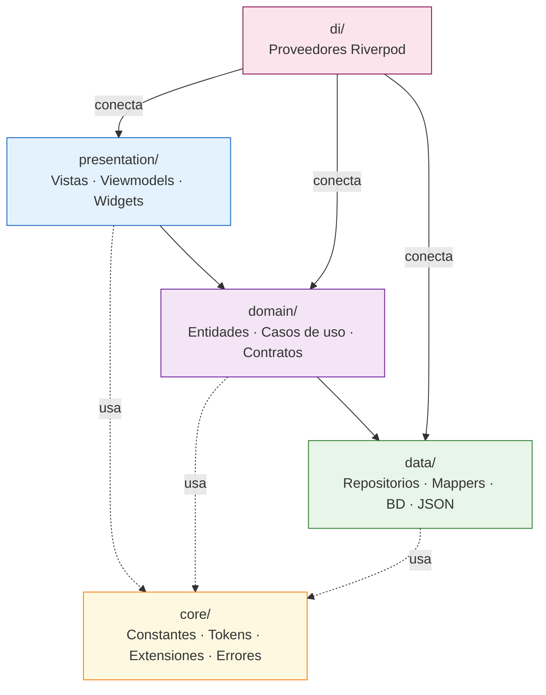

# Arquitectura y capas

El proyecto sigue los principios de **Clean Architecture**: el código está organizado en capas con responsabilidades claras y una única dirección de dependencias.

Cada capa solo conoce las que tiene por debajo, nunca las de arriba.

## 1. Diagrama general



> **Regla de dependencias:** las flechas sólidas indican dependencia directa.
>
> `presentation` puede importar `domain`. `domain` no puede importar nada de `data` ni de `presentation`.

## 2. Capa `core/`

Utilidades globales que cualquier otra capa puede usar. No depende de ninguna otra capa del proyecto.

| Subcarpeta         | Contenido                                                        |
| ------------------ | ---------------------------------------------------------------- |
| `constants/`       | `AppStrings`, `AppSpacing`, `AppRadius`, `AppDuration`, `Assets` |
| `errors/`          | `Result<T>` — el patrón de manejo de errores del proyecto        |
| `extensions/`      | Extensiones de tipos Dart (`MapExtensions`, etc.)                |
| `services/logger/` | Logger centralizado                                              |
| `config/`          | Configuración de entorno                                         |

## 3. Capa `domain/`

El núcleo del negocio. Define **qué** hace la aplicación, sin saber **cómo** se almacenan los datos ni cómo se muestran.

Es la capa más estable del proyecto: cambiar la base de datos o el framework de UI no debe tocar `domain`.

| Subcarpeta      | Contenido                                                            |
| --------------- | -------------------------------------------------------------------- |
| `entities/`     | Objetos de negocio puros: `Event`, `Person`, `DiaryNote`, `AppData`… |
| `repositories/` | Contratos (interfaces) que `data/` debe implementar                  |
| `usecases/`     | Lógica de aplicación: orquestan repositorios y devuelven `Result<T>` |
| `logic/`        | Funciones de dominio puras: calculan estado a partir de entidades    |

**`domain/logic/` vs casos de uso** - la distinción es importante:

- Un **caso de uso** orquesta repositorios y coordina operaciones asíncronas (`GetHomeDataUseCase`, `SaveDiaryNoteUseCase`).
- Un objeto de **lógica de dominio** es una función pura que solo recibe entidades y devuelve un resultado sin tocar la BD ni ningún servicio. `EventStatusResolver.resolve(event)` determina si un evento es `live`, `next` o `ended` solo con las fechas del evento — no necesita repositorio.

**Contrato base de repositorios:**

Aqui se define la interfaz que deben cumplir los repositorios. Esto hace que el resto de la aplicación dependa de esta abstracción, no de la implementación concreta (SQLite, API REST…).

```dart
abstract interface class BaseRepository<T> {
  Future<Result<List<T>>> getAll();
  Future<Result<T>> getById(String id);
}
```

## 4. Capa `data/`

Implementa los contratos definidos en `domain`.

Sabe cómo hablar con SQLite y cómo parsear el JSON. Si mañana se añade una API REST, el cambio ocurre aquí, y `domain` y `presentation` no se enteran.

| Subcarpeta                | Contenido                                               |
| ------------------------- | ------------------------------------------------------- |
| `repositories/`           | Implementaciones concretas de los contratos de `domain` |
| `mappers/`                | Convierten JSON y filas de BD en entidades de `domain`  |
| `dtos/`                   | Objetos intermedios para deserializar JSON complejo     |
| `sources/local/database/` | `AppDatabase` — base de datos Drift (SQLite)            |
| `sources/local/json/`     | `LocalJsonService` — carga el JSON desde los assets     |

## 5. Capa `di/`

Conecta todas las capas usando **Riverpod**.

No contiene lógica de negocio: su único trabajo es instanciar objetos y establecer sus dependencias.

| Fichero                 | Responsabilidad                             |
| ----------------------- | ------------------------------------------- |
| `core_providers.dart`   | Provee `AppDatabase`                        |
| `data_providers.dart`   | Provee los repositorios                     |
| `domain_providers.dart` | Provee los casos de uso y streams derivados |
| `bootstrap.dart`        | Inicialización al arrancar la app           |

> Ver el documento completo de inyección de dependencias en [di.md](di.md).

## 6. Capa `presentation/`

Todo lo que ve el usuario. Se organiza en features (una carpeta por pantalla) y en widgets compartidos.

| Subcarpeta        | Contenido                                                                           |
| ----------------- | ----------------------------------------------------------------------------------- |
| `app/`            | Shell de navegación, tema, providers de estado global                               |
| `features/`       | Una carpeta por feature: `home/`, `schedule/`, `diary/`, `search/`, `settings/`     |
| `shared/widgets/` | Widgets reutilizables entre features: `AppButton`, `AppCard`, `ReadingControlsFab`… |
| `shared/helpers/` | Utilidades de presentación: `DateHelper`, `EventTypeStyle`                          |

Cada feature sigue la misma estructura interna:

```bash
feature/
├── view/         > widgets de pantalla (View, secciones, páginas)
├── viewmodel/    > providers de estado + modelos UI
└── widgets/      > widgets privados de la feature
```

## 7. `I18nStr` — textos multilingües

Varios campos de las entidades (`Event.title`, `ConferenceTheme.description`…) pueden contener texto en varios idiomas. En lugar de usar un `String` plano, se usa **`I18nStr`**: un contenedor con un `Map<String, String>` donde la clave es el código de idioma (`'en'`, `'es'`…).

Ejemplo:

```dart
class I18nStr {
  final Map<String, String> values;

  String resolve(String locale) {
    // Intenta el idioma solicitado → inglés → primer disponible
    return values[locale] ?? values['en'] ?? values.values.first;
  }
}
```

> Al leer un campo `I18nStr` en la UI se llama a `resolve(locale)` con el locale del dispositivo.
>
> La decisión de cuándo resolverlo es de `presentation`, no de `domain` — la entidad solo almacena los valores.

## 8. Resumen de responsabilidades

| Capa           | Pregunta que responde                        |
| -------------- | -------------------------------------------- |
| `core`         | ¿Qué herramientas comparte todo el proyecto? |
| `domain`       | ¿Qué hace la aplicación?                     |
| `data`         | ¿Cómo se obtienen y guardan los datos?       |
| `di`           | ¿Cómo se conectan las piezas entre sí?       |
| `presentation` | ¿Cómo se muestra la información al usuario?  |
