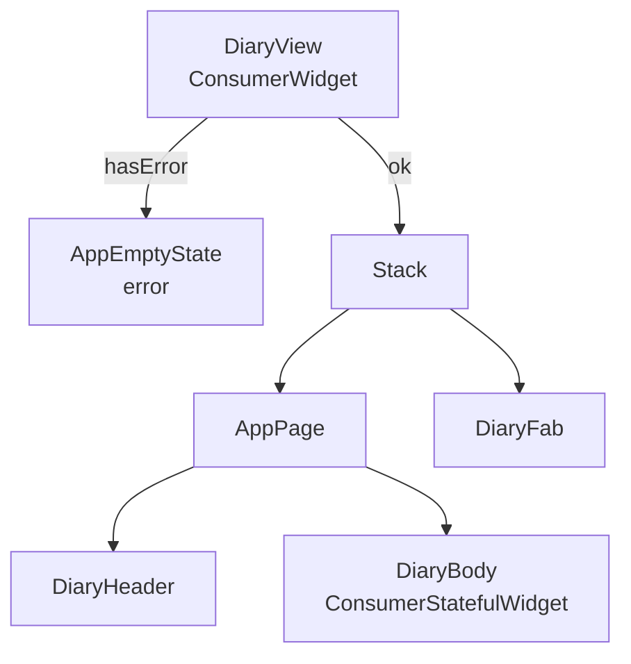
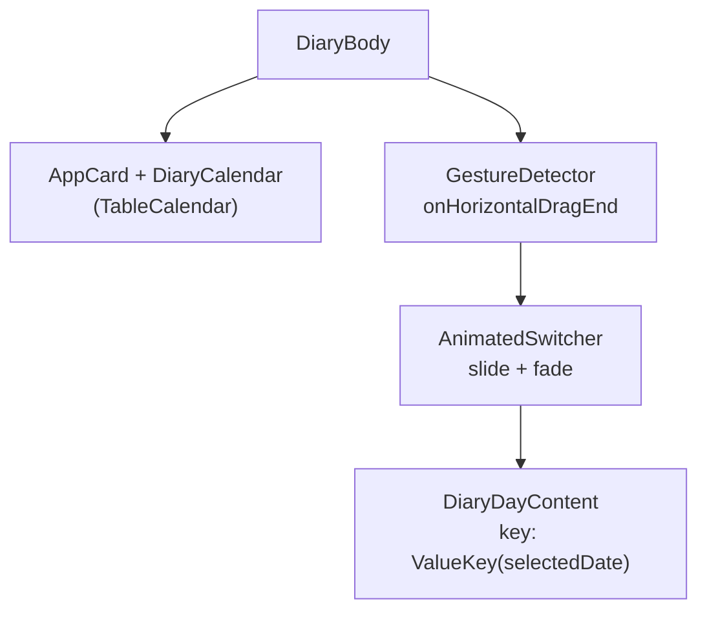
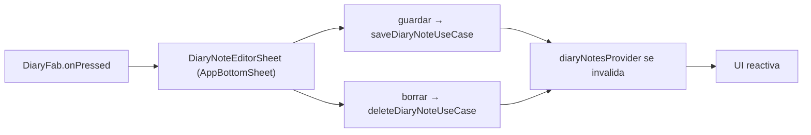

# Pantalla Diary

Diario personal del asistente al congreso. Combina un calendario con notas de texto y eventos del programa en una sola vista.

## 1. Estructura general

> `DiaryBody` gestiona el estado local de animación (`_slideDirection`) y los gestos de swipe horizontal.

## 2. Providers

| Provider                        | Tipo                                     | Qué expone                             |
| ------------------------------- | ---------------------------------------- | -------------------------------------- |
| `diaryNotesProvider`            | `AsyncValue<List<DiaryNote>>`            | Todas las notas del usuario (stream)   |
| `diaryConferenceEventsProvider` | `AsyncValue<Map<DateTime, List<Event>>>` | Eventos del congreso indexados por día |
| `selectedDiaryDateProvider`     | `DateTime`                               | Día seleccionado en el calendario      |
| `diaryFocusedMonthProvider`     | `DateTime`                               | Mes visible en el calendario           |
| `diaryCalendarFormatProvider`   | `CalendarFormat`                         | Formato semana / mes                   |

> Los cinco providers viven en `diary_viewmodel.dart`.

## 3. DiaryBody — composición

> El `AnimatedSwitcher` usa un `SlideTransition` cuya dirección (`_slideDirection`) se calcula comparando el día nuevo con el actual antes de actualizar el estado.

## 4. DiaryDayContent

Muestra las notas y los eventos del día seleccionado en dos listas separadas.

- **Notas** — `DiaryNoteCard` con acciones de edición y borrado.
- **Eventos** — `DiaryEventTile` (solo lectura, vincula al programa del congreso).
- Si no hay nada para ese día se muestra un estado vacío inline.

## 5. Editor de notas (sheet)

`DiaryFab` abre `DiaryNoteEditorSheet` como bottom sheet. El sheet admite creación y edición.

Campos: título · contenido · etiqueta de ánimo (`MoodTag`) · color de fondo.

Las acciones de guardado y borrado van directamente a `saveDiaryNoteUseCaseProvider` y `deleteDiaryNoteUseCaseProvider`.

## 6. Flujo de navegación

