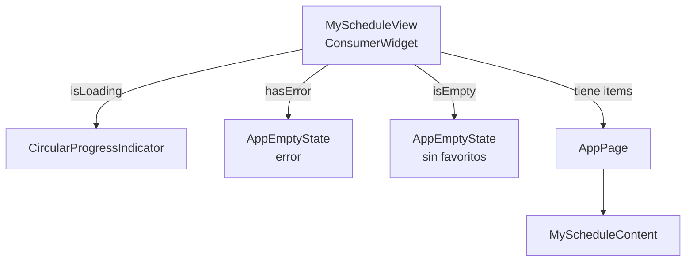

# Pantalla My Schedule

Lista personal de eventos y presentaciones marcados como favoritos, ordenados cronológicamente y agrupados por día.

## 1. Estructura general

> `MyScheduleContent` es un widget separado sin `AppPage` propio — puede embeberse en otras pantallas si fuera necesario.

## 2. Providers

| Provider                    | Tipo                                  | Qué expone                                          |
| --------------------------- | ------------------------------------- | --------------------------------------------------- |
| `myScheduleItemsProvider`   | `Future<List<MyScheduleItem>>`        | Lista plana de favoritos (eventos + presentaciones) |
| `myScheduleGroupedProvider` | `Future<List<MyScheduleDisplayItem>>` | Lista agrupada por día con cabeceras                |

> `myScheduleGroupedProvider` transforma la lista plana en una secuencia de `MyScheduleDayHeader` y `MyScheduleRow` lista para renderizar.

## 3. Modelo de datos

`MyScheduleItem` es un tipo sellado con dos variantes:

| Variante                | Widget                  | Fuente                                      |
| ----------------------- | ----------------------- | ------------------------------------------- |
| `SavedEventItem`        | `EventCard`             | `watchFavoritesUseCaseProvider`             |
| `SavedPresentationItem` | `SavedPresentationCard` | `watchPresentationFavoritesUseCaseProvider` |

`MyScheduleDisplayItem` es el tipo que recibe la lista tras agrupar:

| Variante              | Propósito                                      |
| --------------------- | ---------------------------------------------- |
| `MyScheduleDayHeader` | Cabecera de grupo con fecha y conteo           |
| `MyScheduleRow`       | Envuelve un `MyScheduleItem` para renderizarlo |

> Los items sin fecha se agrupan al final bajo la etiqueta `'Unscheduled'`.

## 4. Flujo de navegación

No hay navegación iniciada desde esta pantalla. Los favoritos se añaden y eliminan desde `ScheduleView` y `SlotPresentationList`. Esta pantalla es de solo lectura.
