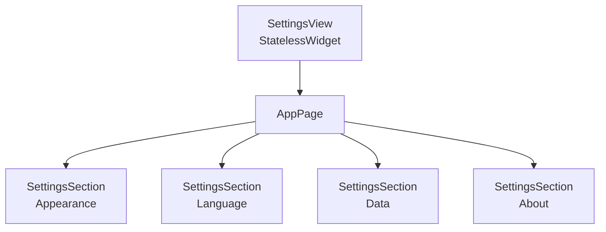

# Pantalla Settings

Ajustes de la app agrupados en cuatro secciones: apariencia, idioma, datos y acerca de.

## 1. Estructura general

> `SettingsView` es un `StatelessWidget`. Los ítems que necesitan estado (`TextSizeItem`, `ThemeItem`) gestionan sus propios providers internamente.

## 2. Secciones e ítems

| Sección        | Ítems                                   | Estado                                  |
| -------------- | --------------------------------------- | --------------------------------------- |
| **Appearance** | `TextSizeItem`, `ThemeItem`             | `textSizeProvider`, `themeModeProvider` |
| **Language**   | `SettingsItem` (App language)           | `ComingSoonBadge` — no implementado     |
| **Data**       | `ReloadDataItem`, `ClearFavouritesItem` | Acciones destructivas con confirmación  |
| **About**      | Edición, versión, web oficial           | Solo lectura                            |

## 3. Componentes clave

**`SettingsSection`**: tarjeta con título etiquetado y lista de ítems separados por `Divider`. El `indent` del divisor se alinea con el texto tras el icono del `ListTile` (constante `_kListTileLeadingWidth = 40.0`).

**`SettingsItem`**: `ListTile` genérico. Si tiene `onTap` y no tiene `trailing` explícito, muestra `chevron_right` automáticamente.

**`ComingSoonBadge`**: chip visual de `secondaryContainer` que indica funcionalidad pendiente.

## 4. Notas

- La versión real de la app (`package_info_plus`) está pendiente — actualmente muestra `'—'`.
- El idioma está fijado en inglés; la localización completa no está implementada.
